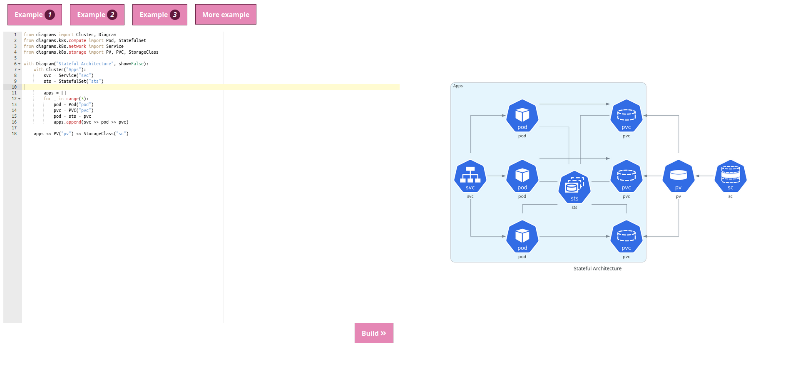

# diagrams-web
Work in progress to bring [diagrams](https://github.com/mingrammer/diagrams) on web.

Contributions are welcome!

This project is built on Python (Flask app), but there is also a Node.js version (Polka and Sapper with Typescript), check it out: [microdiagram](https://github.com/renyuanz/microdiagram)


## Instructions:
from source root, run `docker-compose up --build`

Wait to have something like this:
```shell
web_1  |  * Serving Flask app "app" (lazy loading)
web_1  |  * Environment: production
web_1  |    WARNING: This is a development server. Do not use it in a production deployment.
web_1  |    Use a production WSGI server instead.
web_1  |  * Debug mode: on
web_1  |  * Running on http://0.0.0.0:5000/ (Press CTRL+C to quit)
web_1  |  * Restarting with stat
web_1  |  * Debugger is active!
web_1  |  * Debugger PIN: 830-873-016
```
then open your browser http://0.0.0.0:5000/

and start coding!


