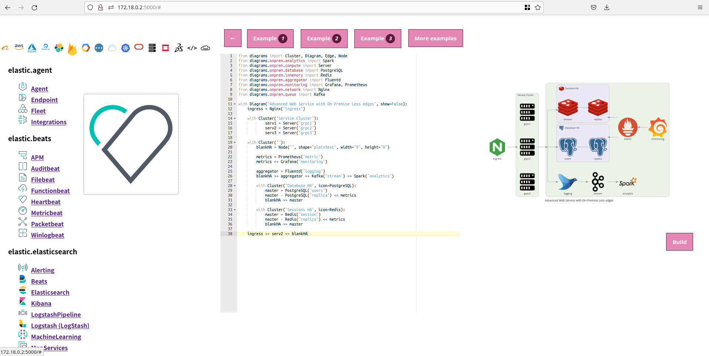

# diagrams-web
Still work in progress to edit and generate [diagrams](https://github.com/mingrammer/diagrams) with your browser (it work on my computer).

Contributions are more than welcome!
You can install and test that it run on your computer, open issues, complain about bugs, ask for features, discuss about ideas, push PR, star the project, join the project etc...

This project is built with Python (Flask app).

No more active project:
- Node.js version (Polka and Sapper with Typescript), check it out: [microdiagram](https://github.com/renyuanz/microdiagram)

## Instructions:

### from source:

from source root, run `docker compose up --build`
or if you can run make command on your system `make build`

Wait to have something like this:
```shell
⠿ Container diagrams-web  Created                                                                                                                                                                     0.0s
Attaching to diagrams-web
diagrams-web  | Generate help templates.
diagrams-web  | Help templates generated.
diagrams-web  |  * Serving Flask app 'app' (lazy loading)
diagrams-web  |  * Environment: production
diagrams-web  |    WARNING: This is a development server. Do not use it in a production deployment.
diagrams-web  |    Use a production WSGI server instead.
diagrams-web  |  * Debug mode: on
diagrams-web  | WARNING: This is a development server. Do not use it in a production deployment. Use a production WSGI server instead.
diagrams-web  |  * Running on all addresses (0.0.0.0)
diagrams-web  |  * Running on http://127.0.0.1:5000
diagrams-web  |  * Running on http://172.18.0.2:5000
diagrams-web  | Press CTRL+C to quit
diagrams-web  |  * Restarting with stat
diagrams-web  |  * Debugger is active!
diagrams-web  |  * Debugger PIN: 480-705-269
```

then open your browser to this address http://172.18.0.2:5000 or http://127.0.0.1:5000

and start coding! (i.e updating the code of diagrams-web)


### from docker hub:

Here is only if you want to use the interface.

Get the image from dockerhub

```shell
docker pull banana123/diagrams-web:beta.1
```

Use any familiar tool to run the container OR

Create a new network if you don't want to mess up with your other projects:
```shell
docker network create --subnet=172.22.0.0/16 diagrams-net
```

Start the container in the previous created subnet with a specific ip.
```shell
docker run --name diagrams-web --net diagrams-net --ip 172.22.0.10 banana123/diagrams-web
```
You should be able to access the interface on:

http://172.22.0.10:5000/

You also should have access to the logs if it crash and you need to debug!

If you need to access inside the container to check what is inside 
```shell
docker exec -it diagrams-web ash
```


